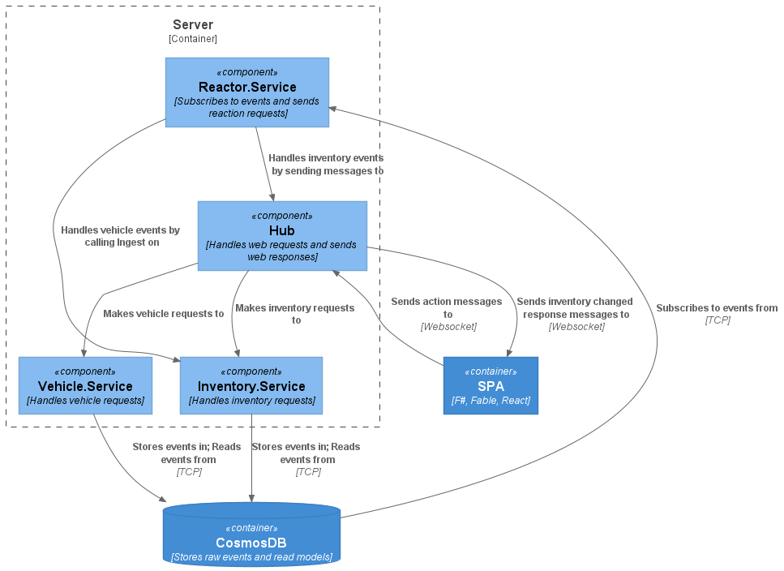

# F# Equinox Reactor
Example system to show how to build a _reactor_ using Equinox and Propulsion
libraries.

## Demo


## Architecture

Context


Server



## Setup
Restore tools.
```
dotnet tool restore
```
Create store container.
```
dotnet eqx init --rus 400 cosmos -s $conn -d test -c test
```
Create lease container.
```
dotnet propulsion init --rus 400 cosmos -s $conn -d test -c test
```

## Usage
Build the services.
```shell
docker-compose build
```

Start the services.
```shell
docker-compose up -d
```

## Development
Install tools.
```
dotnet tool restore
```

Build targets.
```
❯ .\fake.cmd
The following targets are available:
The following targets are available:
   BuildClient
   Clean        
   CleanClient  
   InstallClient
   PublishServer
   Restore
   TestIntegrations
   TestIntegrationsHeadless
   Watch
   WatchClient
   WatchServer
```
