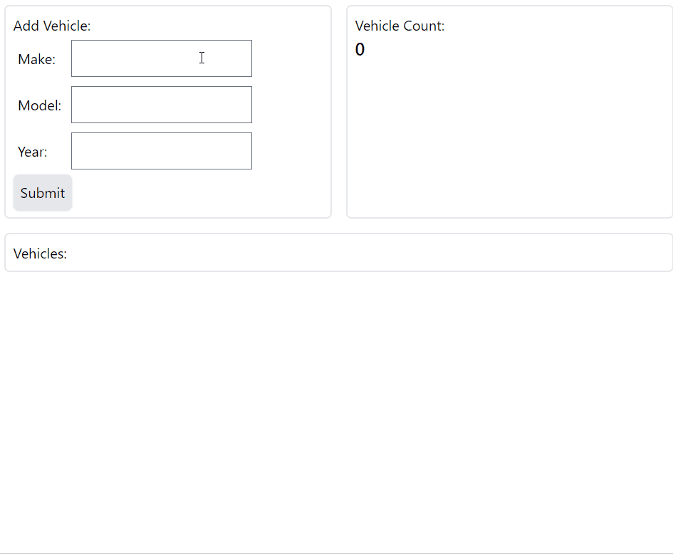

# F# Equinox Reactor
Example system to show how to build a _reactor_ using Equinox and Propulsion
libraries.

## Demo


## Architecture


## Setup
Restore tools.
```
dotnet tool restore
```
Create store container.
```
dotnet eqx init --rus 400 cosmos -s $conn -d test -c test
```
Create lease container.
```
dotnet propulsion init --rus 400 cosmos -s $conn -d test -c test
```

## Usage
Build the services.
```shell
docker-compose build
```

Start the services.
```shell
docker-compose up -d eventstore redis processor reactor reader client
```

## Development
Install tools.
```
dotnet tool restore
```

Build targets.
```
❯ dotnet fake build --list
The last restore is still up to date. Nothing left to do.
The following targets are available:
   BuildClient
   Clean
   Default
   PublishIntegrationTests
   PublishProcessor
   PublishReactor
   PublishReader
   Restore
   StartClient
   StartProcessor
   StartReactor
   StartReader
   TestIntegrations
   TestUnits
```
